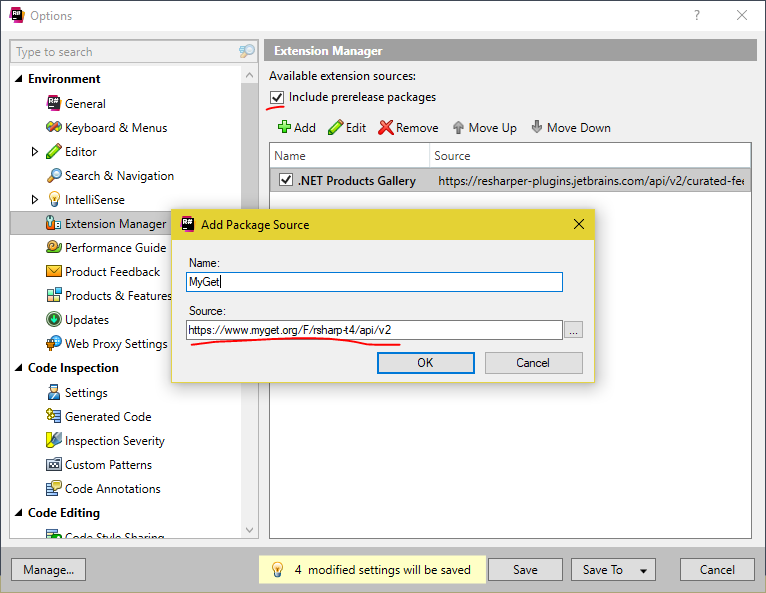
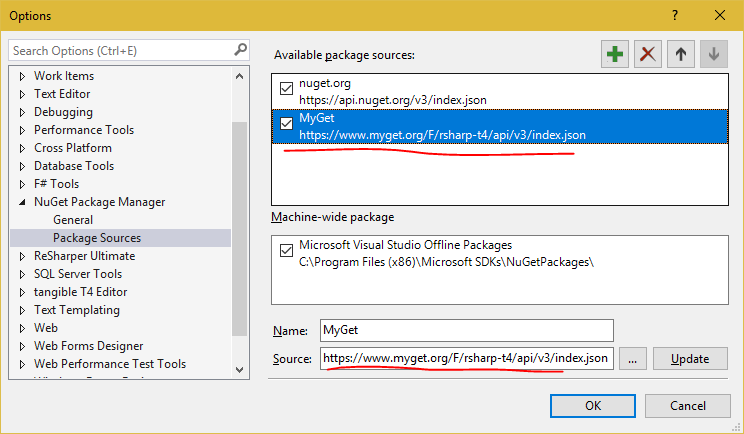
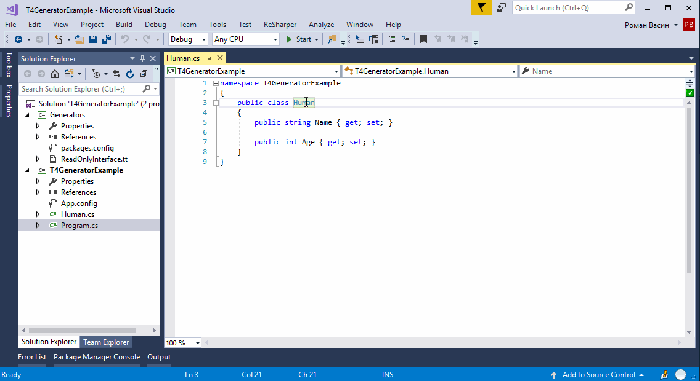
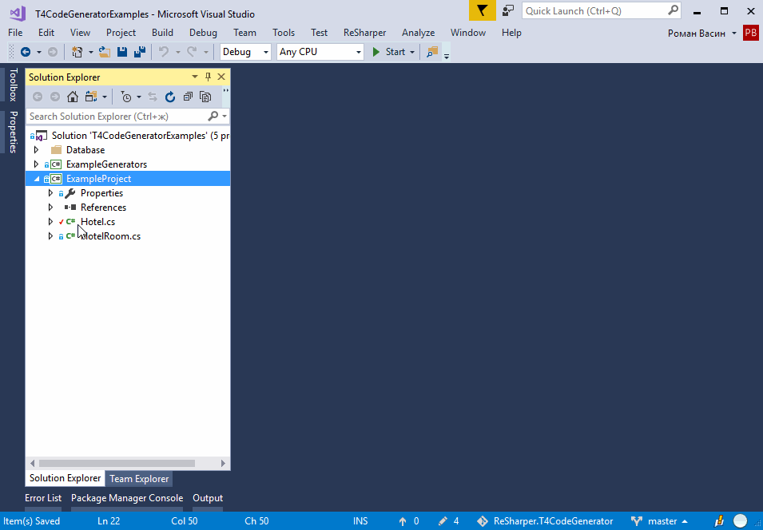

# ReSharper.T4CodeGenerator
Appveyor [](https://ci.appveyor.com/project/dev-someuser/resharper-t4codegenerator)
MyGet [](https://www.myget.org/)

Что это
---
Данный плагин позволяет легко реализовывать пользовательскую генерацию кода на инфраструктуре ReSharper, и с помощью технологии T4.

С чего начать
---
- Установить плагин для Jetbrains ReSharper
  - Добавить extension source
    - Открыть VS, пройти в меню ReSharper -> Extension Manager. В открывшемся окне нажать Options.
    - Добавить новый extension source  
    Name: любое название  
	Source: ```https://www.myget.org/F/rsharp-t4/api/v2```  
	  
	Убедиться, что отмечена галочка **Include prerelese packages**.
    - Закрыть опции.
  - Найти в Extension Manager плагин **Some.T4CodeGenerator** и установить его.
  - Вызов плагина привязан к сочетанию **Alt+=**. К сожаление, сразу после установки плагина, по какой то причине сочетание не срабатывает. Чтобы это исправить, необходимо пройти в опции ReSharper (Resharper->Options...->Keyboard & Menus) и нажать кнопку *Apply Scheme*.
  - Добавить NuGet Package Source. Это необходимо для установки NuGet пакета, который позволит писать генераторы.  
	Source: ```https://www.myget.org/F/rsharp-t4/api/v3/index.json```  
	
  - Для комфортной работы с кодом T4 установить ReSharper плагин [ForTea](https://github.com/MrJul/ForTea)

Первый T4 генератор кода
---
- Создадим новый проект и решение с названием *T4GeneratorExample*. Проект любого типа, для примера создадим *Сonsole App (.NET Framework)*.
- Добавим в решение новый проект типа *Class Library (.NET Framework)* с названием *Generators*. Платформа *.NET Framework* не ниже *4.6.1*.
- Устанавливаем в проект Generators необходимый NuGet пакет. Для этого в консоле Package Manager Console выбирем Default project - Generators. Устанавливаем пакет командой  
    ```Install-Package Some.T4CodeGenerator.Generators.Core -PreRelease -Source https://www.myget.org/F/rsharp-t4/api/v3/index.json```
- Создадим первый генератор. Для примера напишем генератор read-only интерфейсов. Пример взят из [поста](https://blog.jetbrains.com/dotnet/2012/11/06/resharper-sdk-adventures-part-6-readonly-interface-generator/) блога jetbrains, где описан процесс создания отдельного плагина для этой цели.
- Добавляем в проект *Generators* новый элемент типа **Runtime Text Template**. Назовем файл *ReadOnlyInterface.tt*.
- Открываем файл. Первым делом нужно унаследовать наш генератор от базового генератора. В нашем примере базовый генератор - *ByClassFileGeneratorBase*. Удаляем весь текст из файла и добавлем две строчки  
    ```xml
    <#@ template language="C#" inherits="ByClassFileGeneratorBase" #>
    <#@ import namespace="T4CodeGenerator.Generators.Core.Generators.Common" #>
    ```
- Далее нам необходимо реализовать абстрактные методы и свойства базового генератора и написать сам код генератора. Ниже приведен весь код файла.
    ```c#
    <#@ template language="C#" inherits="ByClassFileGeneratorBase" #>
    <#@ import namespace="JetBrains.ReSharper.Psi.CSharp.Tree" #>
    <#@ import namespace="T4CodeGenerator.Generators.Core.Generators.Common" #>
    <#@ import namespace="T4CodeGenerator.Generators.Core.Helpers" #>

    namespace <#=this.ExpectedNamespace#>
    {
	    public interface <#=this.InterfaceName#>
	    {
		    <#foreach(IPropertyDeclaration property in this.Class.PropertyDeclarations.Where(x => x.IsPublic())){#>
			    <#=property.Type#> <#=property.DeclaredName#> { get; }
		    <#}#>
	    }
    }

    <#+
        protected string InterfaceName => $"IReadOnly{this.Class.DeclaredName}";

        public override string Name => "Read-only interface";

        public override string GetFileName() => $"{this.CurrentFolder}\\{InterfaceName}.cs";

        public override bool IsAvailableCore() =>
            this.Class is IClassDeclaration ||
            this.Class is IStructDeclaration;
    #>
    ```
    Реализованные свойства и методы
    - **Name** - название генератора
    - **GetFileName** - путь, куда будет помещен сгенерированный файл.
    - **IsAvailableCore** - определяет, доступен ли генератор в данном местенахождения курсора.
- **!!!Обнаружена ошибка!!!** после первого создания проекта с генераторами необходимо перезапустить VS. Перезапускаем VS.
- Собираем проект *Generators*
- Тестируем. Добавляем в проект T4GeneratorExample класс, например, Human со свойствами Name и Age. Перемещаем курсор на название класса и нажимаем **Alt+=**. Из списка выбираем *ReadOnlyInterface*. Будет создан файл *IReadOnlyHuman.cs* рядом с *Human.cs*  
      

Примеры
---
В решении *Examples/T4CodeGeneratorExamples.sln* находятся примеры разных простейших генераторов.
  